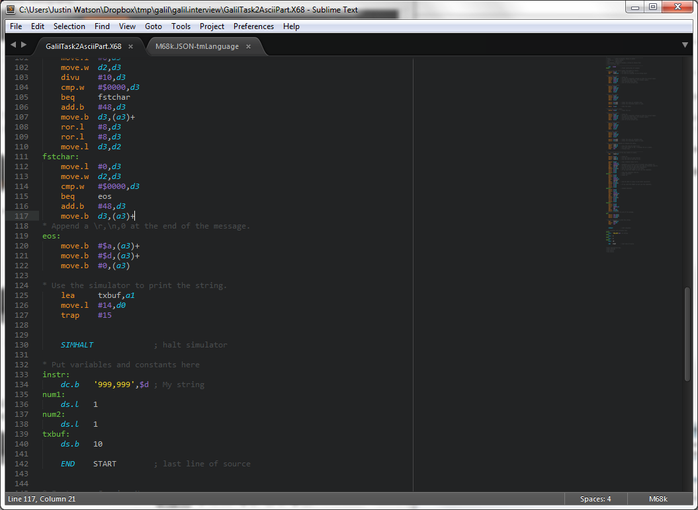

# CPU32 and Easy68k Syntax Highlighting
This is syntax highlighting in for CPU32 instruction set on Easy68k. It could
also be used for Easy68k.

Here is an image of what it looks like with some assembly code.

## Contributing

You can send pull requests via GitHub. Do *not* edit the
`CPU32.tmLanguage` file directly. Edit the
`CPU32.JSON-tmLanguage` file instead and build the `.tmLanguage` file
from it using the _JSON to Property List_ build tool in
[AAAPackageDev](https://github.com/SublimeText/AAAPackageDev).